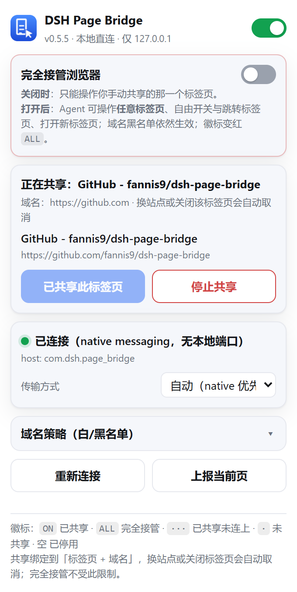

# DSH Page Bridge — 让你浏览的页面可被 DSH 读取与操作

[](https://github.com/fannis9/dsh-page-bridge/actions/workflows/tests.yml)
[](LICENSE)

不用重开浏览器、不换 profile、不动用调试端口：装一个扩展，它把**你正在看的标签页**按需交给本机
的 DSH Agent。



<sub>扩展弹窗（`dev/make-popup-preview.mjs` 可重新生成）：连接状态走的是 native messaging；
「共享当前标签页」是窄模式的入口，「完全接管」则放开到任意标签页。</sub>

```
   你的 Chrome（照常用，登录态都在）
        │  WebSocket  ws://127.0.0.1:8799/ws   （扩展主动外连，所以不需要任何端口/权限）
        ▼
   bridge.mjs  ←──HTTP──  page.mjs（我在 pwsh 里调用的命令行）
        │
        └─ var/events.jsonl：滚动记录你在看什么（标题+URL+时间）
```

- 扩展：`extension/`（MV3，`tabs` + `scripting` + `<all_urls>`；含 16/32/48/128 图标与弹窗开关）
- 图标：`make-icons.py`（Pillow 生成，16/32 用简化字形保证小尺寸可读）
- 桥接：`bridge.mjs`（零依赖，自带 WebSocket 与 native messaging 两种帧实现；闲置自动退出）
- 注册工具：`register-host.mjs`（用户级注册/查看/卸载 native host，可回退）
- 命令行：`page.mjs`（按需拉起桥接）
- MCP 服务端：`mcp-server.mjs`（把桥接包成 22 个 MCP 工具）
- DSH 插件：`dsh-plugin/`（profile bundle，让新会话自带 `mcp__page-bridge__*`）
- 自检/调试：`mock-extension.mjs`（假扩展，无浏览器也能验证链路）、`smoke-mcp.mjs`（MCP 层冒烟测试）、`dev/`：
  - `snapshot-probe.mjs` 快照算法探针（在真实 Chromium 里跑扩展里的同一段代码）
  - `smoke-snapshot.mjs` 快照链路冒烟（自带桥接 + 假扩展，独立端口 8798）
  - `grant-policy-test.mjs` 权限策略单测（26 个断言，含后缀伪装用例）
  - `native-framing-test.mjs` native messaging 帧测试（管道模拟 Chrome，覆盖 host 与 relay）
  - `sw-load-test.mjs` 用假 `chrome` API 加载 service worker（查模块级崩溃 + 传输状态机 5 个场景）
  - `chrome-extension-state.mjs` / `chrome-storage-scan.mjs` Chrome 侧扩展状态与存储诊断
  - `extension-id-test.mjs` 按 Chromium 算法算出扩展 ID，并比对 Chrome/Edge 两份 native 清单
  - `make-popup-preview.mjs` 重新渲染 `docs/popup-preview.png`（假 `chrome` API 喂状态，headless 截图）
  - `key-dispatch-test.mjs` 合成按键测试（真浏览器；验证 keyCode/which 与「回车提交」路径，含反例）
  - `bridge-auth-test.mjs` 能力令牌与 relay 失败关闭（**不需要浏览器，进 CI**）
  - `bridge-queue-test.mjs` per-tab 队列 / 实例路由 / WS 帧上限（**不需要浏览器，进 CI**）
  - `target-resolve-test.mjs` 执行层目标复核：被隐藏 / 被改写 / 签名被删 / 节点被移除（真浏览器）
  - `native-e2e-test.mjs` 真实浏览器端到端（⚠️ 官方 Chrome 137+ 与 Edge 154 都移除了
    `--load-extension`，会直接 SKIP；需 Chromium / Chrome for Testing）
- 运行期产物：`var/`（`events.jsonl` 轨迹、`shots/` 截图）——**可随时清空**
- 文档素材：`docs/popup-preview.png`（弹窗渲染预览）

### 空闲唤醒（重要）

Chrome 会休眠 MV3 扩展的 service worker，而桥接/DSH 端**无法主动唤醒**它，只能等：
标签页切换/加载（立刻）、点扩展图标（立刻）、或 30 秒一次的 alarm（最坏 30 秒）。
所以长时间没碰浏览器后第一次调用可能等几秒到半分钟；`page.mjs` 与 MCP 工具已把这个等待
做进默认值，超时也会给出可操作的提示。**Chrome 没在运行时就一定连不上**（这是最常见的"没反应"原因）。

## 一次性安装（约 30 秒）

**桥接不用你手动常驻**，两种形态都能自己起来：

- 注册过 native host：**Chrome 按需拉起桥接并保活**（推荐；浏览器侧不需要监听端口）；
- 没注册：`page.mjs` / MCP 工具会先探测 `127.0.0.1:8799`，不在就**自己把它拉起来**
  （脱离当前进程、隐藏窗口、无控制台），闲置 30 分钟后自动退出。

1. Chrome 打开 `chrome://extensions` → 右上角打开 **开发者模式** → **加载已解压的扩展程序** →
   选择本仓库的 `extension` 目录。
2. （推荐）注册 native host，让扩展优先走 native messaging：
   ```powershell
   node register-host.mjs register    # 用户级、免管理员
   node register-host.mjs unregister  # 随时撤销（扩展自动回退 WS）
   ```
3. **改过扩展代码后**，在 `chrome://extensions` 里点一次 **↻** 重载（这步最容易被忘）。
4. 点一下工具栏里的扩展图标：注册过 native host 时会显示绿点 +「已连接（native messaging，无本地端口）」。
5. **只用 WebSocket 的情况**（没注册 native host）：本地控制面需要**能力令牌**，所以先运行
   `node page.mjs token` 拿到令牌，粘进弹窗里的「WS 能力令牌」并保存 —— 之后才会显示
   「已连接（WebSocket 回退）」。没粘之前扩展会明确提示"WS 回退需要能力令牌"，不会静默失败。
   （这也正是第 2 步推荐注册 native host 的原因：走 native 时令牌由 Chrome 认证过的通道自动下发，你不用管。）
6. 最后二选一放开范围：点**「共享当前标签页」**（只放开这一个页面）或打开
   **「完全接管浏览器」**（任意标签页，徽标变红 `ALL`）。

之后扩展会自己保持连接（20 秒心跳 + 每分钟重连兜底，重连间隔上限 5 秒；切换/加载标签页也会唤醒它）。

## 懒人装法：让你自己的 agent 帮你装

不想照着上面一步步来？**把下面这段话发给你正在用的 agent**（DSH、Claude Code、Cursor 等任何一个都行），
它会自己把能做的都做完：

> 帮我装一下 Page Bridge：把 https://github.com/fannis9/dsh-page-bridge 克隆到本地任意目录，然后
> ①在该目录运行 `node register-host.mjs register` 注册 native messaging host（用户级、免管理员）；
> ②把我的 MCP 客户端配一个 stdio server，命令是 `node <该目录绝对路径>/mcp-server.mjs`，名字用 `page-bridge`；
> ③跑一遍仓库里的自检脚本（`node dev/grant-policy-test.mjs`、`node dev/sw-load-test.mjs`、
> `node dev/native-framing-test.mjs`）确认没装坏；④最后告诉我需要我在浏览器里手动点哪几下。

**分工说明**（避免你等一个它做不到的事）：

| 谁做 | 内容 |
|---|---|
| 🤖 agent 能全自动 | 克隆/下载 · 注册 native host（路径与扩展 ID 都是自动推导的，**换目录也不用你改 ID**）· 写 MCP 客户端配置 · 跑自检 · 撤销（`register-host.mjs unregister`） |
| 👤 只能你点 | ① `chrome://extensions`（Edge 是 `edge://extensions`）→ 开发者模式 → **加载已解压的扩展程序** → 选 `extension/` 目录 ← **受保护页面，任何浏览器自动化都注入不进去**；② 点扩展图标 → **共享当前标签页** 或 **完全接管浏览器** |

<sub>非 DSH 客户端同理——第 ② 步就是把 `mcp-server.mjs` 当成一个标准 stdio MCP server 挂上去；
`dsh-plugin/` 里那份 profile bundle 是 DSH 专用的现成配置（含 `cordis.patch.yml` 示例，路径留了占位符）。</sub>

需要手动控制桥接时：

```powershell
node page.mjs stop                 # 立刻停掉（下次用会再自动拉起）
node page.mjs status --no-autostart   # 只看状态，不自动拉起
node bridge.mjs --port 8799 --idle-exit 0   # 手动常驻（0 = 不自动退出）
```

## 命令行速查

```powershell
node page.mjs status                 # 连接状态
node page.mjs tabs                   # 所有标签页
node page.mjs state                  # 当前页：标题/URL/选中文本/标题结构/表单/滚动/正文
node page.mjs text --max 40000       # 整页纯文本
node page.mjs html --max 60000       # 原始 HTML
node page.mjs eval "document.title"  # 执行任意 JS（--world MAIN 可读页面变量）
node page.mjs click "text=登录"       # 按 CSS 选择器或 text= 文本点击
node page.mjs type "#q" "关键词"      # 输入（--submit 顺带回车提交）
node page.mjs key Enter "#q"          # 合成按键（带 keyCode；支持 Backspace/ArrowDown 等，--repeat N）
node page.mjs token                   # 打印本地控制面能力令牌（纯 WS 模式要粘进扩展弹窗）
node page.mjs text --tail 3000        # 只取正文末尾（读对话页最新回复很方便）
node page.mjs type "#q" --file a.md   # 长文本从文件读，避开 shell 引号与命令行长度限制
node page.mjs select "#city" "杭州"
node page.mjs scroll "#price"        # 或 --by 800
node page.mjs highlight "#total"     # 在页面上高亮某元素 2.5 秒（你能看见）
node page.mjs shot E:\dsh\screenshots\shot.png   # 可见区域截图
node page.mjs activate 1741125239        # 切到某个标签页
node page.mjs close 1741125240           # 关掉某个标签页
node page.mjs events --limit 30          # 你最近看了哪些页面
node page.mjs wait "#result"         # 等元素出现
```

通用参数：`--tab <id>`（指定标签页，默认当前活动页）、`--wait <ms>`（等扩展连上）、
`--timeout <ms>`、`--json`；令牌相关：`--token <值>` / `--token-file <路径>`（环境变量 `PAGE_BRIDGE_TOKEN` /
`PAGE_BRIDGE_TOKEN_FILE`）——同机跑第二个桥接时必须让它们用不同的令牌文件，否则两个实例互相 401。

## 传输方式：native messaging（首选）+ WebSocket（回退）

扩展有两种方式连到桥接，弹窗里可切换：**自动（native 优先）** / 仅 native messaging / 仅 WebSocket。

| | native messaging（首选） | WebSocket（回退） |
|---|---|---|
| 谁发起连接 | **Chrome 拉起桥接进程**并持有管道 | 扩展主动连 `ws://127.0.0.1:8799/ws` |
| 浏览器侧要不要监听端口 | **不要** | 要（仅环回） |
| worker 被 Chrome 休眠后 | Chrome 负责重启宿主，扩展重连即可 | 等标签页事件 / 30 秒闹钟唤醒 |
| 依赖 | 注册过 native host（下面一条命令） | 无 |
| 日志 | 走 stderr（stdout 只允许协议帧） | 走 stdout |

桥接在 `--native` 模式下若发现端口已被"按需启动"的桥接占用，会**自动降级为中继**
（native ⇄ WebSocket 双向转发），这样始终只有一个端口、一条派发路径；
若此时没有任何桥接在跑，**Chrome 拉起的 native host 自己就成为桥接本体**（host 模式，
`/status` 会显示 `native: true` 且客户端 `via: native`）。两种形态都已实测通过。

注册 / 查看 / 卸载（**用户级、免管理员、完全可回退**）：

```powershell
node register-host.mjs status
node register-host.mjs register      # 写启动脚本 + 清单 + HKCU 注册表
node register-host.mjs unregister    # 撤销（扩展自动回退到 WS）
```

Windows 上会写入 `%APPDATA%\Google\Chrome\NativeMessagingHosts\com.dsh.page_bridge.json` 和
`HKCU\Software\Google\Chrome\NativeMessagingHosts\com.dsh.page_bridge`（Edge 同理），
`allowed_origins` 只允许你的扩展 ID。帧格式（4 字节小端长度前缀 + JSON）由
`dev/native-framing-test.mjs` 用管道模拟 Chrome 验证，覆盖 host 与 relay 两条路径。

排查 native 是否真的生效（不需要浏览器）：

```powershell
node dev\sw-load-test.mjs          # service worker 加载 + 传输状态机
node dev\chrome-extension-state.mjs # Chrome 眼里这个扩展是什么状态
# 是否由 Chrome 拉起：找一个父进程是 chrome.exe 的 bridge.mjs --native
Get-CimInstance Win32_Process | Where-Object { $_.CommandLine -match 'bridge.mjs' -and $_.CommandLine -match '--native' }
```

## Edge 能用吗？能，而且不用额外注册

Edge 是 Chromium，本扩展只用了标准 MV3 API（`scripting` / `storage` / `alarms` / `nativeMessaging` / `tabs`），
所以**同一份扩展目录可以直接在 Edge 里加载**。三个关键点：

**1. 扩展 ID 在 Chrome 和 Edge 里是同一个。** Chromium 的未打包扩展 ID 完全由**绝对路径**决定：

```
id = mapToAtoP( hex( SHA256( pathBytes )[0..15] ) )   # pathBytes：Windows = 路径的 UTF-16LE 编码
```

同一目录 `extension` → 两边都得到 `hoiepnbhhkgaakggccoppmknbalamojh`
（该算法是从真实 profile 反推验证过的）。所以 `allowed_origins` 只写一个 ID 就能两边通用：

```powershell
node dev\extension-id-test.mjs   # 现场算出 ID 并比对 Chrome/Edge 两份清单
```

**2. native host 早已双份注册。** `register-host.mjs` 默认 `--browser both`，会同时写
`%APPDATA%\Google\Chrome\NativeMessagingHosts\` 与 `%APPDATA%\Microsoft\Edge\NativeMessagingHosts\`，
以及对应的两个 `HKCU` 注册表项。所以在 Edge 里点开图标应当直接显示
「已连接（native messaging，无本地端口）」。

**3. 两个浏览器可以同时用**，但要注意 **tabId 是各浏览器自己的编号**。为了不把它们搞混，桥接按三层规则挑目标：

1. **显式固定**（推荐）：`page_use_browser {browser:"edge"}`，之后所有命令都发给 Edge；传空字符串取消固定。
   跨浏览器操作前应该先固定，否则 `page_tabs` 拿到的 id 可能在另一个浏览器里不存在（报"找不到标签页"）。
2. **窗口在前台的那个**：扩展每 20 秒心跳时上报 `focused`，桥接优先选它——你正在看哪个浏览器就是哪个。
3. **最近有"实质动作"的那个**：注意**心跳不算动作**（否则两个浏览器的心跳会交替刷新，目标会来回跳，
   这是我实测踩到并修掉的问题）。

`page_status` 会告诉你：`browsers`（连了哪些）、`effectiveBrowser`（当前会发给谁）、每个客户端的
`focused` 与 `lastActive`，以及 `pinnedBrowser`（是否固定过）。

在 Edge 里加载（与 Chrome 完全一样）：

```
edge://extensions → 左下角打开「开发人员模式」→「加载解压缩的扩展」
→ 选 extension → 点工具栏扩展图标 → 「共享当前标签页」或「完全接管浏览器」
```

若你把扩展**复制到别的目录**再加载，路径变了 → ID 也变。这时重跑一次
`node register-host.mjs register`（它会自动扫描 Chrome/Edge 各 profile 里已安装的 ID 并一并写进
`allowed_origins`），或显式补：`--extension-id <那个 ID>`。

## 完全接管（一键放开范围）

窄模式（默认）只能操作你手动共享的那一个标签页。要让它**自由操作整个浏览器**，在弹窗里打开
**「完全接管浏览器」**（徽标变红 `ALL`）：

| | 窄模式（默认） | 完全接管 |
|---|---|---|
| 可操作标签页 | 只有共享的那一个 | **任意标签页**（默认当前活动页，可用 `tabId` 指定） |
| `page_tabs` 返回 | 只有共享的那个 | 全部标签页 |
| 打开新标签页 | 需要先共享 | ✅ `page_open` 直接开（可后台开，`active=false`） |
| 跳转 / 关闭 / 激活 | 仅共享标签页 | 任意标签页 |
| 白名单 | 生效 | 跳过 |
| **黑名单** | 生效 | **依然生效**（永不碰的域名是一个硬保险） |
| 后台浏览事件记录 | 仅共享标签页 | 仅共享标签页（不因为完全接管就偷偷记录你的浏览轨迹） |
| 徽标 | `ON` | `ALL`（红） |

三条安全设计：

1. **开关只能由你在弹窗里点** —— 桥接侧**没有**对应命令，Agent 无法给自己提权
   （有单测断言：桥接侧发 `setFullAccess` 会返回 `unknown command`）；
2. **黑名单在完全接管下仍然生效**，且每次命令下达时都会重新校验；
3. 完全接管是**持久化**的，关掉浏览器再开仍在，所以徽标会一直红着提醒你（随时可在弹窗关掉）。

## 共享与权限（逐标签授权 + 域名白/黑名单）

默认**什么都不共享**：扩展装好、甚至连接上之后，DSH 也读不到任何页面，直到你**显式共享一个标签页**。
这是借鉴 BrowserMCP 的 per-tab "Connect" 与 mcp-chrome 的权限式访问控制做的一层保护。

开启方式：**点扩展图标 → 「共享当前标签页」**。之后：

| 规则 | 行为 |
|---|---|
| 作用范围 | 只有那**一个**标签页可读可操作；`page_tabs` 只返回它，其他标签页连标题都不给 |
| 绑定域名 | 共享绑定「标签页 + origin」；该标签页一旦导航到**其他站点**，共享自动取消并通知（需要重新共享） |
| 关闭标签 | 共享自动取消 |
| 浏览器重启 | 共享记录存在 `storage.session`，浏览器一关就没了（下次要重新共享） |
| 黑名单 | 命中的域名永不共享（`example.com` 连子域一起拦） |
| 白名单 | **留空 = 除黑名单外都允许**；一旦填写就变成**默认拒绝**，只有命中的域名能共享 |
| 兜底 | 每次命令下达时都会重新校验一次（不只共享那一刻），策略变了立刻生效 |

弹窗里可以随时改两份名单（每行一条，支持 `*.example.com` 通配），改完立即重新校验当前共享。
徽标含义：`ON` 已共享且已连上 · `···` 已共享但桥接没连上 · `·` 已连接但未共享 · 空 总开关关闭。

未共享时任何工具都会返回可操作的提示：*"尚未共享标签页：点浏览器工具栏上的扩展图标 →「共享当前标签页」"*。
策略解析器有单测：`node dev/grant-policy-test.mjs`（26 个断言，含后缀伪装 `example.com.evil.com` 这类用例）。

## 快照与 ref（借鉴 BrowserMCP）

`page.mjs snapshot` / MCP 的 `page_snapshot` 会产出一棵 **Playwright 风格的 ARIA 无障碍树**，
可交互元素带 `[ref=eN]`：

```yaml
- main
  - heading "探索未至之境" [level=1]
  - form
    - textbox "问点什么，一起探索" [ref=e6]
    - button "深度思考" [ref=e7]
  - link "API 开放平台" [ref=e11] [url=https://platform.deepseek.com/]
```

- **ref 能直接当目标用**：`page_click {ref:"e6"}`、`page_type {ref:"e6", text:"…"}`，
  等价于 `selector: "@e6"`（也接受 `e6` / `ref=e6`）。ref 写在 DOM 的 `data-dsh-ref` 上。
- **ref 是稳定的（跨快照不漂移）**：同一个元素在多次快照里保持同一个编号，只有新出现的元素才发新号，
  元素消失后它的 ref 自然失效。这样"点 A 再点 B"时，中间新插入的节点**不会**让后面的 ref 整体错位。
  （早期版本每次快照都重新编号——实测确实会让人点错，这条改动来自一次答题页实测反馈。若某元素的
  ref 恰好没出现在最新快照里，说明它当前不可见，别拿旧 ref 硬点。）
- **变更类工具自动回传快照**：`page_click` / `page_type` / `page_select` / `page_scroll` /
  `page_navigate` 执行后都会附上最新快照（含新 ref），模型不用再手动抓一次。
  这与 BrowserMCP 的 `ToolFactory(snapshot)` 设计一致；可用环境变量关闭：
  `PAGE_BRIDGE_SNAPSHOT=0`（关闭）、`PAGE_BRIDGE_SETTLE_MS=500`（操作后等待毫秒，默认 250）。
- **可以只抓一块区域**：`page_snapshot {selector:"#user-repositories-list"}`（CLI：`snapshot --selector form`）
  只返回该 CSS 选择器命中的子树——GitHub 这类巨型页面用它能把噪声从几百个节点降到十几个。
  选择器不存在会明确报错，不会静默返回整页。
- **长文本/HTML 也支持子树读取**：`page_text {selector:"#target"}` 会读取该子树并穿透其中的 open shadow root；
  `page_html` 也支持 `selector`，并以 `max` 字符与 `maxNodes` 双重硬上限返回 `truncated`，避免整页序列化卡住。
  CLI 对应 `text --selector ...`、`html --selector ... --max-nodes ...`。
- **补齐便宜的 DOM 工具**：`page_count` 统计 composed/shadow DOM 节点，`page_wait` 等待 selector/ref/text= 出现。
- **能看穿"隐形容器"**：快照、`selector`、`text=`、`count` 都会走进这些容器，而不是把整棵子树剪掉：
  1. **open shadow root**（web component；顺带一提，翻译类扩展也会往页面里注入 shadow root）；
  2. **`display: contents`**：自身 `getBoundingClientRect()` 是 0×0，但子节点正常布局——
     GitHub 的对话框就藏在 `<dialog-helper>` 里，栽在这上面会让"对话框明明在屏幕上、快照里什么都没有"；
  3. **`visibility: hidden` 的祖先 + 后代 `visibility: visible` 翻盘**（CSS 允许，`display:none` 不行）。
  4. **闭合的 `<details>`**：只渲染 `<summary>`。Chromium 是用 **slot 机制**隐藏内容的——被隐藏节点的计算样式仍正常、`rect` 也仍有尺寸，所以只能按语义判断，否则折叠的答案/解析会被读出来（我拿自测答题页当靶子时发现的）。

  反例保留：`display: none` / `opacity: 0` / `aria-hidden` 里的内容依然会被正确排除；
  而且**自身不可见的元素不会分配 ref**——否则模型会拿到指向"看不见的按钮"的 ref（例如隐藏的
  「Delete this repository」确认按钮），点下去照样会触发。
  自检：`dev/snapshot-probe.mjs` 的夹具同时造了这三类容器**和两个反例**（见输出的「隐形容器自检」）。
- **截图要窗口在前台**：`page_screenshot` 会先检查目标窗口是否聚焦/最小化，不在前台就**立刻**报错
  （`captureVisibleTab` 在后台窗口上会卡住）；MCP 侧超时也收紧到 15 秒。只要读内容就别用截图。
- **合成按键带真实 `keyCode`/`which`**：`page_key {key:"Enter"}`（CLI：`key Enter [选择器]`）支持
  Enter / Backspace / Delete / Escape / Tab / 方向键 / Home / End / PageUp·Down / 单个字符，可 `repeat`。
  为什么需要：只带 `key` 的 `KeyboardEvent` 其 `keyCode` 是 **0**，而 React 与设计系统（GitHub 的 Primer
  就是）常按 `keyCode` 分支，于是"按回车提交 token"会**静默失效**——这正是我加 topics 时踩的坑。
  `type --submit` 在没有 `<form>` 时也改用这套按键。
  真浏览器自检：`dev/key-dispatch-test.mjs`（含一个**反例**：旧写法派发回车应当提交不了）。
- **`--submit` 和 `page_key Enter` 别混用**：目标是**真实表单**（登录、搜索）时用 `type --submit`
  （会走 `form.requestSubmit()`）；只是"某个组件要求按回车"（如 Primer 的 token 输入框、
  答题页的填空检查）就用 **`page_key Enter`** —— 因为输入框若在 `<form>` 里，`--submit`
  会**触发整表提交**（例如答题页会直接交卷），别拿它赌页面自己的 `preventDefault`。
- 快照算法在扩展里（`extension/background.js` 的 `#region aria-snapshot` 区块），自包含以便注入；
  `dev/snapshot-probe.mjs` 会把这同一段代码抽出来在真实 Chromium 里跑，改算法时可即时验证：
  ```powershell
  node dev\snapshot-probe.mjs                     # 内置夹具
  node dev\snapshot-probe.mjs --url https://x.com --refs
  node dev\snapshot-probe.mjs --selector form     # 只抓某棵子树
  ```
- ⚠️ **跑自检脚本时注意隔离**：`mock-extension.mjs` 与真扩展都会以 `chrome-extension` 身份连桥接，
  桥接会把命令发给**先连上的那个**——真扩展开着时，冒烟脚本可能操作你真实的浏览器（我踩过一次：
  测试里的 `page_click {ref:"e5"}` 真的点开了你页面上的链接）。
  现在 `smoke-mcp.mjs` / `dev/smoke-snapshot.mjs` **自带桥接 + 假扩展并默认跑在独立端口 8798**，
  与真扩展的 8799 完全隔离（`--port` 可改）；手动起 mock 时请记得带 `--port 8798` 并单独起一个桥接。
- 设计来源：[BrowserMCP/mcp](https://github.com/BrowserMCP/mcp)（`src/tools/snapshot.ts`、
  `src/utils/aria-snapshot.ts`：操作后 `captureAriaSnapshot`，输出 URL/Title/围栏 yaml）。

两条已知边界（都已在代码里做成**显式报错**，不再静默失败）：

- **`eval` 默认跑在 `MAIN` 世界**。隔离世界（ISOLATED）在严格 CSP 页面上会**静默拒绝 eval**
  （返回 null、代码不执行）——所以默认改用 MAIN；若某世界禁用 eval，会返回
  `__evalUnavailable` 并给出提示，而不是假装成功。要读页面 JS 变量也必须用 MAIN。
- **`shot` 要求目标 Chrome 窗口可见且聚焦**，否则 `captureVisibleTab` 会长时间挂起。现在 8 秒
  未返回就报错并提示把窗口切到前台。仅需要页面内容时用 `state`/`text` 更稳。

## 贡献来源与许可（致谢）

本项目**没有复制任何第三方源码文件**：算法与实现都是本仓库自己写的，但若干部件的**设计思路、
输出格式与注册约定**照着下面两个开源项目做的。按功能逐条列清楚：

| 本仓库的功能 / 位置 | 来源 | 具体借鉴了什么 | 许可 |
|---|---|---|---|
| 变更类工具执行后自动附带快照（`mcp-server.mjs` 的 `snapshotAfter`） | [BrowserMCP/mcp](https://github.com/BrowserMCP/mcp) `src/tools/snapshot.ts` | 每个变更类工具（click/drag/hover/type/select）执行后都抓一次 ARIA 快照并附在结果里 | Apache-2.0 |
| 快照输出的排版（`- Page URL` / `- Page Title` / 围栏 yaml） | 同上 `src/utils/aria-snapshot.ts` | 逐字照搬输出格式（很短的一段排版约定） | Apache-2.0 |
| 快照开关 | 同上（其 `ToolFactory(snapshot: boolean)`） | 由开关决定是否附带快照 → 本项目的 `PAGE_BRIDGE_SNAPSHOT` / `PAGE_BRIDGE_SETTLE_MS` | Apache-2.0 |
| `[ref=eN]` 引用式寻址 | 同上（其扩展侧 + `ClickTool` 的 `{element, ref}`）；格式参照 [Playwright](https://playwright.dev/) 的 `ariaSnapshot()` | 只借了"快照里带 ref、操作用 ref 而不是猜选择器"这个交互模型；**ARIA 树算法、DOM 标记（`data-dsh-ref`）、ref 解析均为本项目自己实现** | Apache-2.0 |
| 单标签 "Connect" 授权模型 | 同上 `src/context.ts` | 一次只服务一个显式连接的标签页 | Apache-2.0 |
| "没连接"时的可操作提示风格 | 同上 `noConnectionMessage` | 错误信息要直接告诉用户该点哪里 | Apache-2.0 |
| 截图作为 MCP 图片内容返回 | 同上 `src/tools/custom.ts` | `{ type: 'image', data, mimeType }` 的返回形状 | Apache-2.0 |
| 工具定义的数据形状 | 同上 `src/tools/tool.ts` | `{ schema: {name, description, inputSchema}, handle }` → 本项目 `{ name, description, inputSchema, run }` | Apache-2.0 |
| native messaging 注册方式（用户级、免管理员） | [mcp-chrome](https://github.com/hangwin/mcp-chrome) `app/native-server/install.md` | Windows 清单放 `%APPDATA%\<Vendor>\NativeMessagingHosts\`、注册表 `HKCU\Software\<Vendor>\NativeMessagingHosts\`、清单 `path` 指向**启动脚本**（其 `run_host.bat`）、用 `allowed_origins` 限定扩展 ID | MIT |
| 注册 CLI 的形态 | 同上 | 参考其 `register` / `doctor` / `fix-permissions` 的组织方式；本项目简化为 `register` / `status` / `unregister` 且只做用户级 | MIT |
| 权限式访问控制的概念 | 同上（架构文档里的 permission-based access control） | → 本项目做成「逐标签共享 + 域名白/黑名单 + 完全接管」三层 | MIT |

**本项目自己写的部分**：

- `bridge.mjs`：零依赖的 WebSocket 帧编解码 **+** native messaging 帧编解码；`--native` 双形态
  （端口空闲时**自己当桥接**，端口被按需桥接占用时**自动降级为中继**）；
- `extension/`：ARIA 快照算法（role / 可访问名 / 状态属性 / 透明容器 / 结构角色 / 截断）、`data-dsh-ref` 解析、
  权限策略匹配器（含 `example.com.evil.com` 这类**后缀伪装防护**）、共享与完全接管模型、
  native→WebSocket 自动回退状态机、事件只上报已授权标签页；
- `register-host.mjs`：可一键撤销的用户级注册器；
- `mcp-server.mjs` 的工具层、`page.mjs` CLI、`dsh-plugin/` 的 DSH 集成；
- `dev/` 下全部测试与诊断工具（快照探针、权限单测、native 帧测试、假 `chrome` 的 service worker 测试、
  Chrome 扩展状态/存储诊断）——这些是本项目自研的验证手段。

**许可说明**：**本项目自身以 [MIT](LICENSE) 授权**（Copyright © 2026 fannis9）。
所借鉴的 BrowserMCP 与 Playwright 为 Apache-2.0、mcp-chrome 为 MIT；本项目仅借鉴设计、
未摘录其源码，故不附带其源码副本；若将来要直接摘录其中代码，需按对应许可保留版权声明与 NOTICE。
（另：DSH 自带的 `@playwright/mcp` provider 提供 `mcp__playwright-mcp__*` 那 24 个工具，
与 Page Bridge 是**两条独立通路**，不属本项目范围。）

## 安全模型（外部代码评审后收紧）

做过一次外部代码评审（[原始结论与逐条核实](docs/external-review.md)），结论是"架构不用推翻，安全模型需要重新收紧"。据此改了九处，后续两轮又追加两条（10、11）：

1. **本地控制面要令牌**：`127.0.0.1` 不是信任边界（本机任何进程都能连回环端口）。桥接首次启动生成
   `var/bridge-token`，此后**所有 HTTP 与 WS 握手都要出示**它（`Authorization: Bearer <token>`；
   WS 用 `?token=`，因为浏览器无法在 WS 握手里加自定义头）。令牌只经**可信通道**下发给扩展：
   Chrome 拉起的 native 通道（`allowed_origins` 保证只有本扩展能启动宿主），或握手里已出示过令牌的 WS。
    端口被别人抢占时 native host 只会通过一次性 challenge-response 建立 relay：不把能力令牌放进 relay URL，
    也不会接受伪造的 `101` WebSocket 服务端；证明失败就关闭，绝不把 Chrome 认证过的通道交出去。
   `node page.mjs token` 打印令牌；纯 WS 模式需要在弹窗里粘贴一次。
2. **特权设置只认弹窗**：`setFullAccess` / `setPolicy` / `setEnabled` / `share` / `unshare` /
   `setTransport` / `setWsToken` / `push` 都校验 `sender.url` 是 `popup.html`，不再依赖"目前只有 popup 在调"
   这个约定；被拒会记成 `privileged-rejected` 事件（`page.mjs events` 可见）。
3. **执行层复核目标（堵 TOCTOU）**：每个作用于元素的动作（click / type / select / key）执行前重新验证——
   元素还在文档里、现在仍可见、ref 的签名（role + 文本，快照时写进 `data-dsh-sig`）仍与快照时一致；
   签名被页面删掉按**失败**处理（fail closed）。于是"不可见就不给 ref"这条承诺，从渲染时刻延伸到了动作时刻。
4. **窄授权 = origin 级委托**：共享一个标签页等于共享那个 **origin**，而不是"这个标签页可以去任何地方"。
   - `navigate` 跨 origin **事前拒绝**（同 origin 的 SPA 路由照常），黑名单目标始终拒绝；
   - `open` 在窄授权下只允许同 origin；
   - **MAIN world 的 `eval` 在窄授权下禁用**（它是任意 JS 能力，`location.href = ...` / `window.open(...)`
     会绕过上面两条）；需要时用 `--world ISOLATED`，或先开「完全接管」。
5. **动作之后的事后收权**：事前拦截只管得住我们自己发的 `navigate` / `open`；点链接、提交表单、按回车都可能
   让页面自己导航。所以 `click` / `type` / `key` / `select` 执行后会等一下再读一次标签页——跨 origin 或落进
   黑名单就**立即撤销共享**，并把当前 URL 一起回给调用方（结果里带 `grantAlive` / `note`）。
6. **同一个标签页上的命令串行**：桥接按 `(浏览器, 标签页)` 排队，避免"点击 A → 输入 B → 快照 → 点击 C"
   的执行顺序与模型看到的顺序不一致；不同标签页之间互不阻塞。自动快照会固定到**刚接下那一单的浏览器**
   （`/cmd` 回包里带 `browser`），防止动作在 Chrome、快照拍到 Edge。
7. **同一个浏览器多 Profile 可区分**：hello 里带上每个 Profile 的 `instance` id，`/status` 会显示它；
   `page_use_browser` 支持 `chrome@<instance 前缀>` 精确寻址（只写 `chrome` 时仍按 ID 前缀匹配）。
   同一份 `/status` 还会给出 **`extensionVersion`**（当前真正生效的扩展版本）——
   于是"刚才那次重载到底生效没有"是一个字段就能回答的问题，不必再靠 `since` 时间戳加试探命令去反推。
8. **WS / native 单帧上限 8 MB**：声称超大长度的帧直接断连，不再无限缓冲（本机 DoS）；
   WebSocket 客户端帧还必须 masked，分片和保留位会被拒绝。
9. **运行期日志有边界**：`events.jsonl` 默认最多 5 MB，超过后保留文件尾部的最新历史再继续记录；落盘 URL 会移除 query/hash，
   以免把搜索词或一次性 token 长期写入日志。可用 `--max-log-bytes` 或 `PAGE_BRIDGE_MAX_LOG_BYTES` 调整上限。
10. **策略模块缺失时 fail-closed 且可诊断**：`policy.js` 若没加载成功，`lastError` 会明确写出
    "policy.js 未加载…"（弹窗可见），并且**不会去建立连接**；之后任何调用得到的是这条明确错误，
    而不是含糊的 `Cannot read properties of undefined`。
11. **relay challenge 端点本身也要令牌**：本机任意进程都无法靠反复申请把合法 relay 的待用 nonce 挤掉；
    令牌只出现在**回环请求头**里（不进 relay URL、不进 WS 握手），服务端证明验不过就关闭，不转发任何字节。

**语义边界（写清楚，免得误解）**：域名黑名单约束的是 **agent 的操作**，不是"页面永远不会发出请求"——
`page_click` 点到链接、页面自己的 form submit 都可能产生导航。要做到后者需要浏览器级网络策略，
那是另一层工程，目前不做（这条判断也来自评审本身）。

## 自检与 CI

这套自检**不需要浏览器**，所以在 GitHub Actions 上直接跑（[`.github/workflows/tests.yml`](.github/workflows/tests.yml)）：

| 脚本 | 覆盖 |
|---|---|
| `dev/grant-policy-test.mjs` | 权限策略 26 个断言（含 `example.com.evil.com` 后缀伪装） |
| `dev/sw-load-test.mjs` | 用假 `chrome` API 加载 service worker：多场景 + 提权守卫（sender 白名单）+ origin 隔离 + bootstrap 竞态（1b）+ `policy.js` 加载失败（1c） |
| `dev/bridge-auth-test.mjs` | 本地控制面能力令牌：HTTP/WS 认证、relay 失败关闭、challenge 端点抗刷 nonce |
| `dev/bridge-queue-test.mjs` | per-tab 命令队列、instance 路由、WS 帧上限 |
| `dev/native-framing-test.mjs` | native messaging 帧往返：host 模式 + relay 模式 |
| `dev/extension-id-test.mjs` | Chromium 扩展 ID 推导，Chrome/Edge 一致性 |
| `dev/smoke-snapshot.mjs` / `smoke-mcp.mjs` | MCP 层冒烟（自带桥接 + 假扩展，隔离端口） |

本地可以用 `npm run test:browser:fixtures` 一次跑完 4 个脚本：快照探针、目标复核、合成按键、**预览图生成**
（最后一个同时是"脚本有没有断链"的守卫——它曾因重构漏掉一个 `import` 而静默烂掉）；这一组优先使用 DSH 自带的
`playwright-core`，也接受项目根目录的本地安装。真实 Edge native E2E 可用 `npm run test:browser:native`。
GitHub Actions 里另有手动触发的 [`.github/workflows/browser-e2e.yml`](.github/workflows/browser-e2e.yml)：
它在 Windows runner 上安装 Playwright runtime、注册 Edge native host，再运行这组测试；之所以不并入每次 PR，
是因为不同品牌 Chromium 对 `--load-extension` 的支持差异很大。

## 隐私边界

- 页面**内容**只在被调用时那一瞬间读取，不后台持续抓取正文；
- **窄模式下未共享的标签页完全不可见**：只有你点过「共享当前标签页」的那一个能被读/操作；
  打开「完全接管」后范围扩到全部标签页（这是你显式授权的），但黑名单仍生效；
- 后台只记录**已授权标签页**的事件（标题/URL/时间）到 `var/events.jsonl`，不含正文；落盘 URL 会去掉 query/hash，
  即使开了完全接管也不会默默记录你的浏览轨迹；不想要可删该文件或停用桥接；
- 全部流量都在 `127.0.0.1`，不出网；桥接只监听环回地址；
- 扩展对 `chrome://`、Chrome 应用商店等受保护页面无法注入，会明确报错。

## 故障排查

| 现象 | 处理 |
|---|---|
| `浏览器扩展未连接…` | 点扩展图标→「重连」，或切换一次标签页；确认桥接在跑、端口一致（8799） |
| `Cannot access contents of the page` | 该页面受保护（chrome://、扩展商店、部分 PDF 阅读器），属预期 |
| `eval` 在严格 CSP 站点失败 | 换 `--world MAIN` 反而更差时，改用 `click`/`text`/`state` 等 DOM 途径 |
| 一次点击开了两个标签页 | 已修复（旧版 click 同时派发合成 click 与 `el.click()`）。改完 background.js 后需在 `chrome://extensions` 点一次 ↻ 重载扩展 |
| 端口被占（已有桥接在跑） | **通常不用管**：native host 会用一次性 challenge-response 自动降级为**中继**，把帧转发给占端口的那个桥接；若对方拿不出令牌则**失败关闭**（打日志并退出），绝不把 Chrome 认证过的通道交出去 |
| 想同时跑两个桥接 | `bridge.mjs --port 8800 --token-file var/token-8800`，并让扩展用同一套地址与令牌（`extension/background.js` 的 `WS_BASE` + 弹窗里粘贴对应令牌），改完在 `chrome://extensions` 点一次 ↻ |
| DSH 重启后失效 | 桥接是 DSH 的后台任务，随之结束；重跑第 1 步即可（也可做成开机自启） |

## DSH 插件（新对话自动可用）

`dsh-plugin/` 是一个 profile bundle，把本桥接挂成 **MCP 工具**，于是**每个会话**都自带
`mcp__page-bridge__*`（**22 个**），不需要先解释路径：

| 工具 | 作用 |
|---|---|
| `page_snapshot` | **ARIA 快照 + `[ref=eN]`**：最常用的"看清楚现在页面上有什么"；变更类工具执行后会自动附带一份 |
| `page_state` / `page_text` / `page_html` / `page_count` / `page_wait` | 页面摘要 / 子树全文 / 有界 HTML / 节点统计 / 等待元素 |
| `page_tabs` / `page_events` | 标签页 / 浏览轨迹 |
| `page_click` / `page_type` / `page_key` / `page_select` / `page_scroll` / `page_highlight` | 操作页面（`page_key` 发带 `keyCode` 的真实按键；高亮会在你屏幕上闪一下） |
| `page_eval` / `page_navigate` / `page_open` / `page_close` / `page_screenshot` | 执行 JS / 跳转 / 新开标签页 / 关标签 / 截图 |
| `page_use_browser` / `page_status` / `bridge_stop` | 多浏览器时固定目标 / 连接状态 / 停掉桥接（下次自动重启） |

安装方式（**二选一，不要同时装**，`serverName: page-bridge` 必须唯一）：

```powershell
# A. link 安装（可被 plugin_manager 管理）
dsh plugin --profile desktop add link:<仓库路径>\dsh-plugin

# B. 已经生效的等价做法：把 dsh-plugin/cordis.patch.yml 的 insert 段
#    复制进 profile 的 cordis.patch.yml（当前 desktop profile 就是这么挂的）
```

## 可选升级

- 把 `page.mjs` 包一层 **MCP stdio 服务器**，再用 `@deepseek-ai/dsh-mcp-client` 挂一行配置，
  就能变成会话里原生的 `mcp__page-bridge__*` 工具（和现在浏览器工具同一套机制）。
- 需要**真实输入事件/网络与控制台**时，可加 `chrome.debugger`（CDP）：能拿到 `Input.*` 与
  `Network.*` 事件，代价是 Chrome 顶部会出现"正在调试此浏览器"的提示条，且与 DevTools 互斥。
